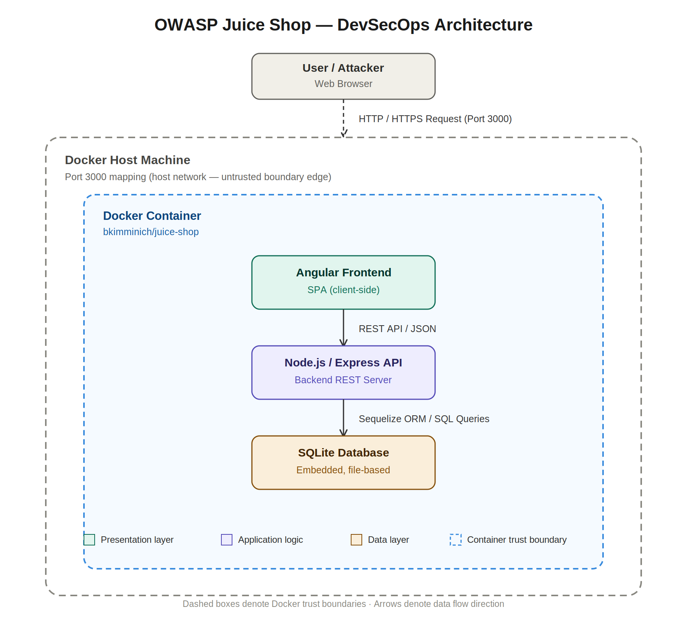

# STRIDE Threat Model — OWASP Juice Shop

## 1. System Context & Overview
This threat model analyzes the OWASP Juice Shop containerized application based on the system architecture. The target system consists of an Angular Single Page Application (SPA), a Node.js/Express REST API backend, and an embedded SQLite database running inside a single Docker container exposed on port 3000.

---

## 2. STRIDE Threat Analysis Matrix

| Threat ID | STRIDE Category | Component / Asset | Threat Description | Attack Vector | Mitigation Strategy |
| :--- | :--- | :--- | :--- | :--- | :--- |
| **TH-01** | **Spoofing** | User / Authentication | Attacker spoofs an authenticated user session using stolen JWT tokens or weak credentials. | Credential stuffing, weak password hashes, or unverified JWT tokens. | Implement strong password policy, enforce MFA, and validate JWT signatures securely on backend. |
| **TH-02** | **Tampering** | Data / REST API | Unauthorized modification of request payload, price values, or basket items. | Parameter tampering via HTTP interceptors or direct API exploitation (e.g., changing quantity or total amount). | Perform strict server-side validation for all incoming request payloads; never trust client-side data. |
| **TH-03** | **Repudiation** | Logging / Express API | An attacker performs malicious transactions or attacks without audit logs capturing the action. | Lack of comprehensive event logging for critical backend transactions (admin logins, user creation). | Implement centralized, immutable security logging (e.g., Winston logger) for all security-sensitive APIs. |
| **TH-04** | **Information Disclosure** | SQLite DB / REST API | Exposure of sensitive user data (passwords, emails, credit card details) or detailed stack traces. | SQL Injection (SQLi), error handling exposing stack traces, or missing authorization checks on API routes. | Use parameterized queries via Sequelize ORM, sanitize error responses, and enforce strict Authorization checks (RBAC). |
| **TH-05** | **Denial of Service** | Express API / Container | Application becomes unavailable due to resource exhaustion or heavy payload attacks. | Unrestricted file uploads, large payloads, or API rate limit absence leading to memory exhaustion. | Enforce rate limiting (express-rate-limit), set payload size limits, and configure Docker CPU/memory limits. |
| **TH-06** | **Elevation of Privilege** | Node.js Backend / Docker | Attacker escalates privileges from standard user to admin, or performs container escape. | Broken Access Control (BOLA/IDOR), running container process as `root`, or vulnerable dependencies. | Implement robust Role-Based Access Control (RBAC), run Docker container as non-root user (`USER node`). |